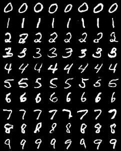

# CGAN
Conditional Generation of MNIST images using conditional DC-GAN in PyTorch 1.6.

Based on the papers * [Conditional Generative Adversarial Nets](https://arxiv.org/abs/1411.1784) 

Deeply borrowed code from *[Pytorch-conditional-GANs](https://github.com/malzantot/Pytorch-conditional-GANs) 


Sample Results




## Usage

```
python gan_trainer.py
```